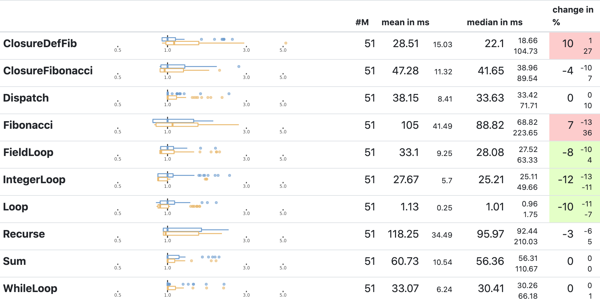

---
#!Rscript ../render.R min-iterations.Rmd min-iter.html out
title: "Is This Noise, or Does This Mean Something? #benchmarking"
#title: "Analyze Benchmark Results to Determine Minimum Viable Number of Benchmark Iterations"
output: html_notebook
---

# Is This Noise, or Does This Mean Something? #benchmarking
## Do my performance measurements allow me to conclude anything at all?

For the development of various research languages ([SOM], [SOMns], ...) we have
used continuous performance tracking for the better part of the last decade.

One should think, we would know what we are doing.

For the last half year, I have been using [ReBenchDB] to track performance,
and use the same statistical tools, that I am using for academic research
papers. While it's a great tool, and built for exactly what I want to do,
it made me question more strongly than before whether I can even trust these
benchmark results.

{height=300px}

The screenshot shows a table of the benchmark results of an experiment
for which I would like to know whether it changes the performance
of my language implementation.
I picked a section [from the full report](https://rebench.stefan-marr.de/compare/SOMns/546c1f8e011e1c4671f375b7dc76c97acfb4e428/ef8d51508b48b00f79bc50a63712b174745d103d) showing microbenchmarks, since I would expect
them to be the simplest to explain.

On first inspection, the results seem mixed. We got two benchmarks marked as red and three as green,
which may indicate slowdowns and speedups.
Though, a closer look at the boxplots indicates that we can't really draw
any strong conclusions. The boxes pretty much overlap, and my experience tells 
me that this may as well just be noise. I have seen similar ups and downs
rather frequently on these benchmarks.

This kind of means, I can't tell with any kind of confidence whether the change
I tried to benchmark has any kind of positive or negative consequences for
performance. The only thing I can tell is that nothing went terribly wrong.
I guess that's at least something.

One option may perhaps be to let the benchmarks run for longer.
Currently, it takes about 40min for the benchmark setup to run.
If the reliability of the results could be increase,
perhaps running the benchmarks for an hour may still be good enough.
Much longer run times will just mean that benchmarking will be ignored,
so, there's really an upper limit on how long things can take.
Another option might be adding more benchmarking machines, though,
currently, there's no budget for that either.

So, what would it take to improve the reliability of my benchmarks
and get numbers that I can trust more readily?

### Gathering More Data to Understand What's Going On

The benchmarking setup I am using relies on [ReBench]. This means,
in the ideal case, I can simply ask ReBench to execute every benchmarks for 3000
iterations and repeat this 30. Since I know that compilation triggers after
1000 iterations, this should give us fully warmed up execution.
Having everything executed 30, i.e., using 30 invocations should make sure that
any variation accross different invocations can also be determined reliably.

This should be all we need to change about the setup:

```shell
rebench --invocation=30 --iteration=3000 rebench.conf
```

Now it's sit back and wait. In my case, the whole run took about 7.5 days.
Not something that's practical for everyday development...

### Get a Bit of an Overview of All the Data

Once we have the data, I like to get an overall impression of how things look.
A line chart that shows the iterations on the x-axis and the run time of
an iteration in milliseconds on the y-axis should do the job.

Though, we got 30 invocations for every benchmark. To see how these invocations
differ, I'll plot them all but make the lines transparent, which should allow
us to see when the behavior changes.

```{r setup, echo=FALSE, include=FALSE}
if (!suppressPackageStartupMessages(library(here, logical.return=TRUE))) {
  install.packages("here", repos="https://cloud.r-project.org/")
  library(here)
}
source(here("libs", "common.R"), chdir = TRUE)

# data1 <- load_data("https://rebench.stefan-marr.de/rebenchdb/get-exp-data/137")
data1 <- load_data("https://rebench.stefan-marr.de/rebenchdb/get-exp-data/37")
#data2 <- load_data("https://rebench.stefan-marr.de/rebenchdb/get-exp-data/36")


warmup_plot <- function (data_b, upper_bound = 3, highlight_invocation = 4) {
  ## First take the medians over the values for each commitid separately
  ## use the highest one with a little margin as an upper bound
  upperBound <- (data_b %>%
    dplyr::group_by(commitid) %>%
    dplyr::summarise(median = median(value), .groups = "drop_last") %>%
    dplyr::summarise(upperBound = max(median) * upper_bound))$upperBound
  
  plot <- ggplot(data_b, aes(x=iteration, y=value)) +
    coord_cartesian(ylim=c(0, upperBound)) +
    geom_vline(
      xintercept = seq(0, max(data_b$iteration), 100),
      linetype = "longdash", colour = "#dddddd") +

    geom_line(aes(group = invocation), color = "#0000ff", alpha = 0.05) +
    ylab(levels(data_b$unit)) +
    xlab("iterations") +
    theme_simple(8) +
    theme_no_legend() +
      theme(axis.title.x = element_text(margin = margin(t = -6))) +
    scale_force_origin_continuous()
  if (is.numeric(highlight_invocation)) {
    plot <- plot + geom_line(
      data = data_b %>% filter(invocation == 4),
      size=0.1,
      color = "#cc0000", alpha = 1)
  }
  
  plot <- plot +
    # after this iteration, we consider data hot
    geom_vline(
      xintercept = 2000,
      linetype = "longdash", colour = "#cc0000")
  
  plot
}

steady_suites <- c("macro-steady", "micro-steady", "savina-jit")

data_f <- data1 %>%
  ## exclude interpreter results, and also SOMns-native. It's just more stuff
  ##  but not really contributing to the goal
  dplyr::filter(suite %in% steady_suites, exe != "SOMns-native") %>%
  dplyr::select(-c(cores, extraargs, criterion, warmup, varvalue, cmdline, inputsize,
                   trialid, runid, expid)) %>%
  droplevels()
data_f$invocation <- factor(data_f$invocation)
```

The first plot below shows the [IntegerLoop](https://github.com/smarr/SOMns/blob/release/core-lib/Benchmarks/LanguageFeatures.ns#L192-L197) 
benchmark, which runs a loop from -20000 to 20000 and assigns a variable with
by subtracting the current loop index from itself. It's a classic microbenchmark
and I wouldn't expect too many complications from it.

```{r integer-loop-all-data, results='asis', echo=FALSE, cache=TRUE}
cp("<figure>")
warmup_plot(
  data_f %>% filter(bench == "IntegerLoop", suite == "micro-steady", exe == "SOMns-graal"),
  highlight_invocation = NA)
cp("<figcaption>IntegerLoop benchmark on SOMns</figcaption>")
cp("</figure>")
```

Though, the plot shows a few interesting bits. First note that there is a clear
dark blue line coming down and then settling at about 25ms.
At iteration 1000, we can see a clear spike. At this point, the `benchmark`
method crossed the compilation threshold and got compiled.
Before, only the inner block/lambda was compiled, I think.
Unfortunately, by compiling the `benchmark` method itself, performance seems to
decrease a bit to about 30ms, an almost. Since compilers rely on heuristics,
these things can happen.
Though, it would be good to look into why it happens here.

But back to the plot itself. We also see light blue spikes,
in different shades of blue, and different sizes. These spikes likely
correspond to garbage collection or compilation events.
Though, overall, the result is pretty stable. Except for the undesirable slowdown,
we would hope that benchmarks look like this. All thirty invocations would
report the same result.

The next plot below shows the
[Vacation](https://github.com/smarr/SOMns/blob/release/core-lib/Benchmarks/Vacation.ns) benchmark,
which is a simulation for a travel agency that has been used for instance to
benchmark software transactional memory systems.
The version used here, relies on threads and locks, even though, we run it only
with a single thread.

```{r vacation-data, results='asis', echo=FALSE, cache=TRUE}
cp("<figure>")
warmup_plot(
  data_f %>% filter(bench == "Vacation", suite == "macro-steady", exe == "SOMns-graal"))
cp("<figcaption>Vacation benchmark on SOMns</figcaption>")
cp("</figure>")
```
The plot is clearly less nice than the one for IntegerLoop.
Only after about a 100 iterations, we reach a point where the measurements fit onto the plot.
This shows that the compiler can optimize the benchmark very well, but it takes time to do so.
Eventually, the benchmark reaches a run time of under 2ms, which isn't ideal,
since we might simply be measuring noise at this level of performance.

We also see that there is a much larger area that is different shades of blue.
Though, there seems to be a somewhat blue core, which indicates that there is a
somewhat normal-ish distribution of iteration times across our 30 invocations
of the benchmark.

Just to emphasize what is visualized, I picked out one invocation,
and instead of plotting it in a transparent blue, it's plotted in red.
Here we can clearly see the many ups and downs within a single
invocation, but the overall trend seems to stabilize.


```{r all-data, results='asis', class.output="all-data-plots", fig.height=2.5, fig.width=3.5, echo=FALSE, cache=TRUE}
for (e in levels(data_f$exe)) {
  data_e <- data_f %>%
    dplyr::filter(exe == e) %>%
    droplevels()
  
  # for (s in levels(data_e$suite)) {
  for (s in steady_suites) {
    data_s <- data_e %>%
      dplyr::filter(suite == s) %>%
      droplevels()
    
    for (b in levels(data_s$bench)) {
      data_b <- data_s %>%
        dplyr::filter(bench == b) %>%
        droplevels()
      
      cp('<div><span class="warmup-benchmark">', b, '</span><span class="warmup-suite">', s, '</span><span class="warmup-exe">', e, '</span>')
      cp('<div class="warmup-plot">')
      print(warmup_plot(data_b, highlight_invocation = 3))
      cp('</div></div>')
    }
  }
}
```

### How Close Can We Get to the "True" Average Performance?

After inspecting our plots, and considering the compilation threshold of 1000
iterations, it seems plausible to define the "true" average for our benchmarks
based on the measurements after the 2000th iteration. 
In the previous plots, you may have noticed the red dashed line at the 2000th
iteration. This definition gives us 1000 iterations to calculate the average
from. As a somewhat stable average, I'll use the median for now.
Let's assume for simplicity that this is fine.


```{r calc-hot-stats, echo=FALSE, cache=TRUE}
hot <- data_f %>%
  dplyr::filter(iteration > 2000) %>%
  droplevels()

calc_all_stats <- function(value) {
  median <- median(value)
  mean   <- mean(value)
  min    <- min(value)
  q      <- quantile(value, probs = c(0.05, 0.10, 0.15, 0.20, 0.25))

  data.frame(median = median,
             mean = mean,
             min = min,
             q5 = q[[1]], q10 = q[[2]], q15 = q[[3]], q20 = q[[4]], q25 = q[[5]]
             )
}

name_total_hot <- function(df) {
  colnames(df) <- paste0("total_hot_", colnames(df))
  df
}

stats_hot <- hot %>%
  dplyr::group_by(exe, suite, bench) %>%
  dplyr::summarise(
    name_total_hot(calc_all_stats(value)),
    .groups = "drop"
  )

```

Since the time benchmarking takes needs to be practical,
I need to to minimize this warmup threshold as well as the number of iterations
used to calculate the median, while keeping it within an acceptable range of
the "true" median I calculated from the last 1000 iterations.

To get a feeling of whether this is workable, I'll visualize how far off
the median is when I take various different warmup thresholds and
number of iterations to calculate the average.

```{r calc-warmup-stats, echo = FALSE, cache=TRUE}
warmup <- seq(1, 2000, by = 25)
iter   <- seq(1, 1000, by = 25)
params <- crossing(warmup, iter)
param_list <- split(params, seq(nrow(params)))

plan(multisession, workers = availableCores())

# Sequential version:  stats_for_params <- purrr::map(param_list, function (p) {
stats_for_params <- future_map(param_list, function (p, stats_hot, data_f) {
  stats <- data_f %>%
    dplyr::filter(iteration >= p$warmup & iteration <= (p$warmup + p$iter)) %>%
    droplevels() %>%
    dplyr::group_by(exe, suite, bench) %>%
    dplyr::summarise(median_ = median(value), .groups = "drop") %>%
    left_join(stats_hot, by = c("exe", "suite", "bench")) %>%
    dplyr::mutate(diff_to_hot_median = abs(total_hot_median - median_),
                  diff_to_hot_median_ratio = abs(total_hot_median - median_) / total_hot_median)
    
  list(max_iter = p$warmup + p$iter,
       warmup   = p$warmup,
       stats    = stats)
}, stats_hot = stats_hot, data_f = data_f)

## end the parallel workers. mostly useful for interactive sessions
# future:::ClusterRegistry("stop")
```
    
```{r fn-plot-warmup-params, echo=FALSE, cache=TRUE}
color_palette <- colorRampPalette(colors = c("blue", "yellow", "red"))(length(warmup))

extract_stats_for_b <- function (d, b, s, e) {
  max_iter <- d$max_iter
  iter     <- d$max_iter - d$warmup
  warmup   <- d$warmup
  
  data_for_b <- d$stats %>%
    filter(bench == b, suite == s, exe == e) %>%
    droplevels()
  data.frame(max_iter, iter, warmup, data_for_b)
}

filter_diagonal <- function(warmup, iter) {
  # the -1 are because the values start counting at 1 which makes this a little awkward...
  # using the abs <= 25 gives use a wide step function with more data,
  # but without any duplicates for max_iter, so, it should work for plotting
  abs((warmup - 1) - (2 * (iter - 1))) <= 25
}

plot_median_diff_from_hot <- function(b, s, e, legend_height = 20) {
  for_viz <- purrr::map_dfr(stats_for_params, extract_stats_for_b, b, s, e)

  for_viz_filtered <- for_viz %>%
    filter(diff_to_hot_median_ratio <= 0.05) %>%
    mutate(diff = diff_to_hot_median_ratio * 100,
           marked = filter_diagonal(warmup, iter))

  plot <- ggplot(for_viz_filtered, aes(x=iter, y=warmup)) +
      geom_tile(aes(fill = diff)) +
      scale_fill_gradientn(colors = color_palette, limits = c(0, 5), name = "% diff") + #n.breaks = 10,
      guides(fill = guide_colourbar(barheight = legend_height, nbins=10)) +
      xlab("num. iterations") +
      geom_point(shape = 3, alpha = 0.4,
                 data = for_viz_filtered %>% filter(marked)) +
      # scale_shape_manual(values = c("marked"=3, "unmarked"=FALSE)) +
      theme_simple(8) +
        theme(legend.title = element_text(size = 8))
  print(plot)
}
```

<!--
#### How to Read these Plots?

- blue indicates the closest match with the determine true median
  (based on the `hot` stats)
- red is indicating a larger difference
- note that the scale adapts to the benchmark
- all data above 5% from true median is filtered out for better visualization
-->

The plot below depicts the difference to the "true" median in percent.
A clear blue means that the median calculated from after discarding the
warmup iteration on the y-axis and using only the first n iterations (x-axis)
is identical to the "true" median. A clear bright red means the median differs
by 5%. If no color is given, the median differs more than 5%.

```{r int-loop-median-diff-from-hot, results='asis', echo=FALSE, fig.height=5, fig.width=7, cache=TRUE}
cp("<figure>")
plot_median_diff_from_hot("IntegerLoop", "micro-steady", "SOMns-graal")
cp("<figcaption>Difference from \"true\" median in % for IntegerLoop</figcaption>")
cp("</figure>")
```

This means, for our IntegerLoop benchmark, we can match the figure easily to
our previous figure. Because of how the compilation decided to optimize,
we have initially a performance that differs by about 20% from the "true" median
and thus, is left white.
Around the 1000th iteration, discarding them as warmup,
and using only perhaps 100 iterations for the mean, we see some yellow, which
means the mean is off by 2.5%. Below 1000 iterations of warmup, but with more
than a 100 or so iterations, we see a darker shade of blue, indicating perhaps
1% difference from the mean. The rest is clear blue, indicating that which ever
configuration of warmup and iterations we chose would match the true median.

For the Vacation benchmark, the plot is quite a bit more interesting.
For the most parts, we are far off the "true" median. Though, then with
increasing number of warmup and used iterations, we get close to it.
Establishing a somewhat diagonal where the values become gradually more accurate.

```{r vacation-median-diff-from-hot, results='asis', echo=FALSE, fig.height=5, fig.width=7, cache=TRUE}
cp("<figure>")
plot_median_diff_from_hot("Vacation", "macro-steady", "SOMns-graal")
cp("<figcaption>Difference from \"true\" median in % for Vacation</figcaption>")
cp("</figure>")
```

Looking at these plots for all benchmarks below, we see that for quite a number,
things look pretty good, and they have a lot of blue. Though, there are also
a number, where we clearly see that the compilation threshold is an issue,
and we only get closer to the "true" median, after we crossed it.
For other benchmarks, there are a lot of parts that do not come close to the
"true" median, like for the Vacation benchmark.

```{r median-diff-from-hot-all-data, results='asis', class.output="all-data-plots", fig.height=2.5, fig.width=3.5, cache=TRUE}
#options(warn=0)
#warning=FALSE, error=FALSE, 
# b <- "CD", s <- "macro-steady", e <- "SOMns-graal"

for (e in levels(data_f$exe)) {
  data_e <- data_f %>%
    dplyr::filter(exe == e) %>%
    droplevels()
  
  # for (s in levels(data_e$suite)) {
  for (s in steady_suites) {
    data_s <- data_e %>%
      dplyr::filter(suite == s) %>%
      droplevels()
    
    for (b in levels(data_s$bench)) {
      cp('<div><span class="warmup-benchmark">', b, '</span><span class="warmup-suite">', s, '</span><span class="warmup-exe">', e, '</span>')
      cp('<div class="warmup-plot">')
      
      tryCatch(
        plot_median_diff_from_hot(b, s, e, legend_height = 10),
        error = function(ex) {
          cp('Error for ', b, ' ', s, ' ', e)
          print(ex)
          cp(ex)
        }
      )
      
      cp('</div></div>')
    }
  }
}
```

### A More Stable and Informative Metric?

While the above plots give us some insight in how much warmup and number of
iterations are needed to gets close to the "true" median,
the precision leaves a bit to be desired.
To make these plots readable, I also avoided to add other colors to distinguish
between values below and above the "true" median.

Originally, I wanted to introduce also the use of [bootstrapping](https://en.wikipedia.org/wiki/Bootstrapping_(statistics)) here,
which would avoid making unsupported assumptions about the distribution of
measurements.
Unfortunately, it turned out to be impractical with the large data sets at hand.
Instead, I'll look at a few quantiles, the arithmetic mean, and minimum.
The minimum has been shown before as a metric that stabilizes fast, though,
I assume that it does hide possibly important changes in practice.

To investigate these metrics,
I will look at the pairs of warmup and number of iterations that fall roughly
on the diagonal of the plots in the last section, indicated by the crosses.


Analyze the data, per benchmark/exe/suite
- [x] what's the plain average/median per invocation
- what's the plain average/median (over all iterations)
- what's max difference between iterations
- after how many iterations/invocations do we reach overall average/median
- is minimum more stable, faster?
- is certain percentile more stable, faster?

- if i only use N iterations and M invocations, is the results for N' and M' significantly different at some point for larger values?
- which is the smallest N and M to get to the same results as for max(N) and max(M)?

```{r calc-stats, echo = FALSE, cache=TRUE}
# plan(multisession, workers = availableCores() / 2)

diagonal <- params %>%
  filter(filter_diagonal(warmup, iter)) %>%
  mutate(max_iter = warmup + iter)

diagonal_list <- split(diagonal, seq(nrow(diagonal)))

# based on inspection, 2000 seems a overall good value
stats_for_diagonal <- future_map(diagonal_list, function (p, stats_hot, data_f) {
  stats <- data_f %>%
    dplyr::filter(iteration >= p$warmup & iteration <= (p$warmup + p$iter)) %>%
    droplevels() %>%
    dplyr::group_by(exe, suite, bench) %>%
    dplyr::summarise(calc_all_stats(value),  .groups = "drop") %>%
    left_join(stats_hot, by = c("exe", "suite", "bench"))
  # %>%
  #  dplyr::mutate(diff_to_hot_median = abs(total_hot_median - median_),
  #                diff_to_hot_median_ratio = abs(total_hot_median - median_) / total_hot_median)
    
  list(max_iter = p$warmup + p$iter,
       warmup   = p$warmup,
       stats    = stats)
}, stats_hot = stats_hot, data_f = data_f)

summary(data_f)
data_p <- data_f %>%
  filter(exe == "SOMns-graal", suite == "macro-steady", bench == "CD") %>%
  droplevels()

get_bca((data_p %>% dplyr::filter(iteration >= 1000 & iteration <= 1500))$value, 100)

# future:::ClusterRegistry("stop")

base <- data_f %>%
  dplyr::group_by(exe, suite, bench) %>%
  dplyr::summarise(
    base_median = median(value))


# Scaling is not useful, because it does not allow me to compare things like sd and things directly, I still need to scale those
# norm <- data_f %>%
#   left_join(base, by = c("exe", "suite", "bench")) %>%
#   dplyr::group_by(exe, suite, bench) %>%
#   dplyr::mutate(norm_val = value / base_median)


```

These Hot stats are the ground truth
How can I determine the min(inv) and min(iter) with min(stat_hot - stat')?
we have multiple parameters: inv, iter, warmup. Warmup for hot is guessed at 2000.
Assumption is that warmup happens uniform over inv (strong assumption, but needed for practicality)
Can we find a way to optimize for iter=1?
Which of the different stats is best?

I can iterate over the iter and hot variables, fine, but what to do with the
inv? maybe at let those at 30 for the start, fixed
Then, I could possibly sort the invs by their distance from the median or median
If sorted by median, I can take the highest and lowest until sufficient data is reached


## Identify Stable Metric

Others have found the minimum run time to be the most stable metric,
but it is unclear that this is indeed a useful metric.

Therefore, we will look at a number of different metrics
including various quantiles.

The exploration of the warmup vs iteration indicates that less warmup can
be compensated to a degree with more iterations.
To compare metrics, I want a line plot where the y-axis shows the closeness
to the true value, and the x axis represents how much measuring has to be done.

As a first attempt, I am going to go for a diagonal through the previous
plots, that is gradually increase `warmup` and `iter`.
This should correspond to a diagonal through the previous plots.

One could also play with the angles to afterwards look at other alternatives.

```{r max-iter-fn,          eval = FALSE, echo = FALSE}
# x <- iter
# y <- warmup = 2*iter
# max_iter <- x + y

plot_stats_diff_from_hot <- function(b, s, e) {
  for_viz <- purrr::map_dfr(stats_for_params, extract_stats_for_b, b, s, e) %>%
    # the -1 are because the values start counting at 1 which makes this a little ackward...
    # using the abs < 101 gives use a bit more of a step function with more data,
    # but without any duplicates for max_iter, so, it should work for plotting
    filter(abs((warmup - 1) - (2 * (iter - 1))) < 101) %>%
    dplyr::mutate(
      diff_median = (total_hot_median - median_) / total_hot_median,
      diff_mean   = (total_hot_mean   - mean)    / total_hot_mean,
      diff_min    = (total_hot_min    - min)     / total_hot_min,
      diff_q5   =   (total_hot_q5     - q5)      / total_hot_q5,
      diff_q10  =   (total_hot_q10    - q10)     / total_hot_q10,
      diff_q15  =   (total_hot_q15    - q15)     / total_hot_q15,
      diff_q20  =   (total_hot_q20    - q20)     / total_hot_q20,
      diff_q25  =   (total_hot_q25    - q25)     / total_hot_q25
    )
  
  # TODO: reshape columns into rows or something to make plotting easier, and also the diff calculation
  
  plot <- ggplot(for_viz, aes(x=max_iter)) +
    geom_hline(aes(yintercept =  0.01), color = "#666666", linetype = "dashed") +
    geom_hline(aes(yintercept = -0.01), color = "#666666", linetype = "dashed") +
    geom_line(aes(y = diff_min,    color = "min"),    alpha = 0.5) +
    geom_line(aes(y = diff_q5,     color = "q05"),    alpha = 0.5) +
    geom_line(aes(y = diff_q10,    color = "q10"),    alpha = 0.5) +
    geom_line(aes(y = diff_q15,    color = "q15"),    alpha = 0.5) +
    geom_line(aes(y = diff_q20,    color = "q20"),    alpha = 0.5) +
    geom_line(aes(y = diff_q25,    color = "q25"),    alpha = 0.5) +
    geom_line(aes(y = diff_mean,   color = "mean"),   alpha = 0.5) +
    geom_line(aes(y = diff_median, color = "median"), alpha = 0.5) +
    scale_color_manual(values = c(
      median = "#66c2a5",
      mean = "#fc8d62",
      min = "#dadaeb",
      q05 = "#bcbddc",
      q10 = "#9e9ac8",
      q15 = "#807dba",
      q20 = "#6a51a3",
      q25 = "#4a1486"
    )) +
    coord_cartesian(ylim = c(-0.05, 0.05)) +
    theme_simple(8)
  print(plot)
}
```

```{r stats-diff-from-hot, results='asis', warning=FALSE, error=FALSE,         eval = FALSE, echo = FALSE}
options(warn=0)
for (e in levels(data_f$exe)) {
  data_e <- data_f %>%
    dplyr::filter(exe == e) %>%
    droplevels()
  
  # for (s in levels(data_e$suite)) {
  for (s in steady_suites) {
    data_s <- data_e %>%
      dplyr::filter(suite == s) %>%
      droplevels()
    
    for (b in levels(data_s$bench)) {
      data_b <- data_s %>%
        dplyr::filter(bench == b) %>%
        droplevels()
      
      cp('<div><span class="warmup-benchmark">', b, '</span><span class="warmup-suite">', s, '</span><span class="warmup-exe">', e, '</span>')
      cp('<div class="warmup-plot">')
      
      plot_stats_diff_from_hot(b, s, e)
      cp('</div></div>')
    }
  }
}
```

### How many invocations do I need?

- what's the diff between slowest and fastest inv stats on hot?
- 

```{r prep-inv-data,             eval = FALSE, echo = FALSE}
stats_hot_i <- hot %>%
  dplyr::group_by(exe, suite, bench, invocation) %>%
  dplyr::summarise(
    median = median(value),
    
    mean   = mean  (value),
    min    = min   (value),
    
    q5     = quantile(value, probs = 0.05),
    q10    = quantile(value, probs = 0.10),
    q15    = quantile(value, probs = 0.15),
    q20    = quantile(value, probs = 0.20),
    q25    = quantile(value, probs = 0.25)
  )

stats_hot_i_stats <- stats_hot_i %>%
  dplyr::group_by(exe, suite, bench) %>%
  dplyr::summarise(
    m_median          = median(median),
    diff_median       = max(median) - min(median),
    diff_median_ratio = (max(median) - min(median)) / median(median),
    
    diff_mean       = max(mean) - min(mean),
    diff_mean_ratio = (max(mean) - min(mean)) / median(mean),
    
    diff_min       = max(min) - min(min),
    diff_min_ratio = (max(min) - min(min)) / median(min),
    
    diff_q5        =  max(q5)  - min(q5),
    diff_q5_ratio  = (max(q5)  - min(q5)) /  median(q5),
    diff_q10       =  max(q10) - min(q10),
    diff_q10_ratio = (max(q10) - min(q10)) / median(q10),
    diff_q15       =  max(q15) - min(q15),
    diff_q15_ratio = (max(q15) - min(q15)) / median(q15),
    diff_q20       =  max(q20) - min(q20),
    diff_q20_ratio = (max(q20) - min(q20)) / median(q20),
    diff_q25       =  max(q25) - min(q25),
    diff_q25_ratio = (max(q25) - min(q25)) / median(q25)
  )

```


# Raw Data

```{r,           eval = FALSE, echo = FALSE}

stats <- stats %>%
  left_join(stats_hot, by = c("exe", "suite", "bench"))

stats_i_stats <- stats_i %>%
  dplyr::group_by(exe, suite, bench) %>%
  dplyr::summarise(
    iDiffMean        = max(mean) - min(mean),
    iDiffMeanRatio   = (max(mean) - min(mean)) / mean(mean),
    iDiffMedian      = max(median) - min(median),
    iDiffMedianRatio = (max(median) - min(median)) / mean(median),
     
    meanSd = sd(mean),
    mean   = mean(mean),
    medianSd = sd(median),
    median = mean(median),
    minSd  = sd(min),
    min    = mean(min),
    # maxSd  = sd(max),
    # max    = mean(max),
    q5Sd   = sd(q5),
    q5     = mean(q5),
    q10Sd  = sd(q10),
    q10    = mean(q10),
    q15Sd  = sd(q15),
    q15    = mean(q15),
    q20Sd  = sd(q20),
    q20    = mean(q20),
    q25Sd  = sd(q25),
    q25    = mean(q25)
  )
```


TODO(2020-07-04)
 - does it make sense to somehow measure the distance of specific metrics
   from the metrics for specific iterations?
   I'd think so, not yet sure how to do that


## Further Reading

- Prague (Petr Tuma) (presentation at JKU)
- benchmarking in the cloud paper 
    Duet Benchmarking: Improving Measurement Accuracy in the Cloud
    L. Bulej, V. Horký, P. Tůma, F. Farquet, A. Prokopec
    Proceedings of the ACM/SPEC International Conference on Performance Engineering
    https://arxiv.org/abs/2001.05811
    
    
Do We Teach Useful Statistics for Performance Evaluation?
L. Bulej, V. Horký, P. Tůma
Companion Proc. 8th ACM/SPEC on Intl. Conf. on Performance Engineering
http://doi.acm.org/10.1145/3053600.3053638
    
- warmup paper


[SOM]: https://som-st.github.io
[SOMns]: https://github.com/smarr/SOMns#readme
[ReBench]: https://github.com/smarr/ReBench#readme
[ReBenchDB]: https://github.com/smarr/ReBenchDB#readme
